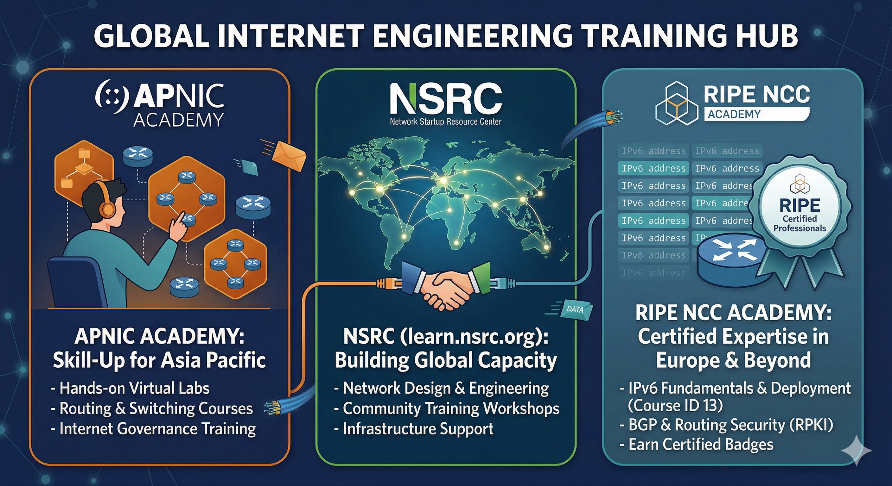

<!-- 
MARP Slide Deck for IPv6 for Leaders Workshop
Each slide is designed with appropriate content density
Image placeholders are included where visuals would enhance the content
-->

# IPv6 for Leaders
### A Strategic Guide for Decision Makers

---

# Workshop Agenda (1)

### Session One (11:45 AM - 1:15 PM)
- IPv6 Basics in Business Terms
- Business Case for IPv6 Adoption
- Security Considerations
- Tracking Adoption with APNIC Labs
- IPv6 and Sustainable Development Goals
- Multi-Stakeholder Model and Governance

---

# Workshop Agenda (2)

### Session Two (2:00 PM - 3:30 PM)
- Adoption Barriers and Solutions
- IPv6 Address Planning
- Deployment Planning
- Measuring Success and ROI
- Future-Proofing
- Learning & Development Strategy

---

# Section 1: IPv6 Basics in Business Terms

---

## What is IPv6?
- Next generation Internet Protocol
- Designed to replace IPv4
- 128-bit addressing (vs. 32-bit for IPv4)
- Enables the continued growth of the Internet
- Foundation for next-generation applications and services

---

> **Facilitator note:** Keep technical detail out of this workshop.
> Your audience are managers and leaders — not engineers.
> If participants want to go deeper on protocol mechanics, packet headers, or implementation specifics, point them to the technical training track:
> **github.com/IEISI-ORG/ipv6_training**

<!-- _class: lead -->

---

## IPv4 Address Exhaustion

- IANA global pool exhausted: Early 2011
- Regional registries (RIRs) at various stages of depletion
- Address markets emerging with rising costs
- Increasing use of workarounds (CGNATs, address sharing)
- Business impact: increased costs, reduced functionality

---

---

## Key Differences That Matter to Leaders

- Address space: 340 undecillion vs. 4.3 billion addresses
- Built-in security with IPsec
- Simplified header structure for better routing efficiency
- Auto-configuration capabilities
- Better support for mobile networks

---

## The Scarcity to Abundance Mindset

- IPv4: Conservation mindset
  - Careful address allocation
  - NAT as standard practice
  - IP addresses as limited resource
  
- IPv6: Abundance mindset
  - Generous subnet allocation
  - Direct end-to-end connectivity
  - IP addresses as unlimited resource

<!-- [IMAGE PLACEHOLDER: Visual comparing scarcity vs. abundance approaches to network design] -->

---

# Section 2: Business Case for IPv6 Adoption

---

## Future-Proofing Your Digital Infrastructure

- Preparing for Internet of Things expansion
- Supporting cloud-native architectures
- Enabling edge computing models
- Simplification of network management
- Elimination of NAT complexity
- Direct addressing for security and monitoring

<!-- [IMAGE PLACEHOLDER: Diagram showing digital transformation elements enabled by IPv6] -->

---

## Competitive Advantages of Early Adoption

- Market differentiation opportunities
- Avoiding last-minute rushed implementations
- Lower long-term costs with planned transitions
- Enhanced capability for innovative services
- Improved customer experience (especially mobile)
- Talent attraction and retention advantages

---

## The Growth Problem

- IPv4 scarcity as barrier to internet growth
- IPv4 address prices: **$60+ (2022 peak) → ~$20 (2025)** — and still falling
- Service degradation from address sharing (CGNAT)
- Early-adopting regions hold vast legacy allocations — late adopters pay the "laziness tax"
- IPv6 eliminates regional inequity: **IPv4 slows down growth. IPv6 enables it.**

<small>_Source: [IPv4 Address Sale Price Trends](https://medium.com/@terrysweetser_90287/ipv4-address-sale-price-trends-abf45620d34f) — Terry Sweetser, IEISI_</small>

---

---
## The Cost Of IPv4 Addresses

---

## Prices are volatile
## Prices are trending downwards
## Prices are varied by size

# WHY?

---

# Section 3: Security Considerations in IPv6 Transitions

---

## Security Myths and Realities

### Myth: IPv6 is inherently more secure than IPv4
### Reality: IPv6 has different security characteristics, not inherently better

### Myth: IPv6 eliminates the need for firewalls
### Reality: Firewalls remain essential in IPv6 deployments

### Myth: NAT provides security
### Reality: NAT provides obscurity, not true security

---

## Security Constants Across Protocols

- Defense in depth remains essential
- User authentication requirements unchanged
- Application security equally important
- Data encryption still necessary
- Monitoring and logging critical

<!-- [IMAGE PLACEHOLDER: Security layers diagram applicable to both IPv4 and IPv6] -->

---

## Beyond NAT: Security in an IPv6 World

- Direct addressing doesn't mean direct access
- Stateful and stateless firewalls remain essential
- Address plan segmentation for security zones
- Unique security considerations:
  - Larger scanning space
  - Extension header inspection
  - Neighbor Discovery Protocol protection

<!-- [IMAGE PLACEHOLDER: IPv6 security architecture diagram] -->

---

## IPv6 Security Governance

- Security policy updates for IPv6
- Risk assessment for transition period
- Dual-stack security considerations
- Skills development for security teams
- Monitoring strategy adjustments
- Incident response procedure updates

---

# Section 4: Tracking Adoption with APNIC Labs

---
## https://labs.apnic.net/measurements/

---

## Global and Regional Adoption Trends

- Current global IPv6 adoption: **~43%** capable (APNIC Labs, March 2026)
- Leading countries: India (~78%), France (~86%), Germany (~74%), USA (~59%)
- Leading regions: South Asia, Europe, North America
- Mobile networks driving much of the adoption (Reliance Jio: India's leap)
- Pacific Islands: early stage — first-mover opportunity
- Wide variation in enterprise adoption

---

https://stats.labs.apnic.net/ipv6

---

https://stats.labs.apnic.net/ipv6

---

https://stats.labs.apnic.net/ipv6/QS

---

## Using APNIC Labs Statistics

- Methodology: browser-based measurement
- Country and network-level statistics
- Historical trends and growth patterns
- Different measurement types:
  - Preferred address selection
  - DNS resolution capabilities

---
https://www.google.com/intl/en/ipv6/statistics.html

---
https://www.google.com/intl/en/ipv6/statistics.html

---

## Benchmarking Your Organization

- Comparing to industry peers
- Geographic considerations
- Identifying adoption gaps
- Setting realistic targets
- Tracking progress over time
- Using data to inform strategy

<!-- [IMAGE PLACEHOLDER: Benchmark matrix template for organization assessment] -->

---

# Section 5: IPv6 and Sustainable Development Goals

---

## IPv6 and SDG Alignment

- SDG 9: Industry, Innovation and Infrastructure
  - Expanded connectivity
  
- SDG 11: Sustainable Cities and Communities
  - Smart city applications
  
- SDG 10: Reduced Inequalities
  - Bridging digital divide
  
- SDG 13: Climate Action
  - More efficient networks

<!-- [IMAGE PLACEHOLDER: Matrix showing IPv6 contributions to SDGs] -->

---

## Case Studies: IPv6 and Sustainability

### Case Study 1: Rural Connectivity
- Enhanced Network Management and Performance 
- Energy Efficiency and Sustainability
- Future-Proofing Rural Networks

### Case Study 2: Smart City Implementation
- Cost-Effective Deployment and Operation
- Better Support for Growing Number of Devices

---
## https://www.mdpi.com/605136

---

<!-- [IMAGE PLACEHOLDER: Smart city implementation using IPv6] -->

---

# Section 6: Multi-Stakeholder Model and IPv6 Governance

---

## How the Internet Is Governed

- The Internet has no single owner, government, or regulator
- It runs on **voluntary consensus standards** — organisations that agree to interoperate
- Governance is **multi-stakeholder**: technical community, governments, civil society, and private sector all have a voice
- This is different from most infrastructure — it is deliberately not controlled by any one nation or company
- Key forums: **ICANN**, **IETF**, **Internet Governance Forum (IGF)**, **Regional Internet Registries**

> Understanding this system helps leaders make better decisions about where influence, risk, and policy levers actually are.

---

## Key Players and What They Do

| Organisation | Role |
|---|---|
| **ICANN** | Coordinates domain names, IP address policy, and root DNS — the "address book" of the Internet |
| **IETF** | Develops open technical standards, including IPv6 (RFC 8200) — no membership fee, anyone can participate |
| **RIRs** (APNIC, ARIN, RIPE NCC, LACNIC, AFRINIC) | Allocate IP address space regionally; your organisation gets addresses through them or your ISP |
| **Internet Governance Forum (IGF)** | UN-convened annual forum — governments, business, and civil society discuss Internet policy |
| **National task forces / NOGs** | Local coordination bodies; often the best entry point for regional operators |

---

## Why This Matters to Leaders

- **Policy is made here** — address policy, routing security, and naming rules all come from these bodies
- **Your voice counts** — ICANN and IETF are open processes; Pacific operators are underrepresented
- **Sovereignty questions** — debates about Internet fragmentation ("splinternet") are active in the IGF
- **IPv6 is a governance issue, not just a technical one** — who gets addresses, at what cost, under what rules
- APNIC membership gives your organisation a direct stake in regional policy decisions

> The organisations setting Internet rules are accessible. The question is whether you are at the table.

---

## Interactive Discussion #1 -- IPv6 Readiness Assessment

1. Form small groups (4-5 people)
2. Complete the assessment worksheet:
   - Technical infrastructure
   - Staff knowledge and skills
   - Business case understanding
   - Executive support
   - Security preparedness
3. Identify top 3 strengths and 3 gaps
4. Share key insights (2-3 minutes per group)

---

# Section 7: Common Adoption Barriers and Solutions

---

## Technical and Knowledge Barriers

Barriers | Solutions
---------|---------
Limited IPv6 expertise | Targeted training programs
Incomplete vendor support | Vendor assessment
Integration challenges | Phased implementation
Perception of complexity | Proof of concept deployments

---

## Financial Considerations

Barriers | Solutions
---------|---------
Unclear ROI | Business case frameworks
Competition for IT resources | Integration with refresh cycles
Legacy system replacement costs | Cost avoidance quantification
Operational expense concerns | Staged investment approach

<!-- [IMAGE PLACEHOLDER: ROI calculation framework diagram] -->

---

## Organizational Change Management

Barriers | Solutions
---------|---------
Resistance ("IPv4 works fine") | Clear articulation of benefits
Competing priorities | Strategic alignment
Lack of executive sponsorship | Executive education
Siloed responsibility | Cross-functional teams

---

# Section 8: What to Look for in an IPv6 Address Plan

---

## Strategic Allocation Principles

- Hierarchical design for scalability
- Allocation strategy by:
  - Geographic location
  - Business function
  - Security zones
  - Growth accommodation
- Numbering conventions
- Readability vs. efficiency

<!-- [IMAGE PLACEHOLDER: Hierarchical address allocation diagram] -->

---

## Security by Design in Address Planning

- Isolation of security domains
- Unpredictable addressing where appropriate
- Stable addressing for critical infrastructure
- Transition mechanism addressing
- Temporary address considerations
- Alignment with security policy requirements

---

## Organizational Structure in Addressing

- Address delegation strategy
- Department/function reflection in addressing
- Site/location considerations
- Service-based addressing
- Growth accommodations
- Documentation and governance

<!-- [IMAGE PLACEHOLDER: Organization-to-address mapping example] -->

---

# Section 9: Evaluating a Deployment Plan

---

---

---

## Milestone Planning for IPv6

- Assessment and inventory phase
- Address planning phase
- Core infrastructure enablement
- Security implementation
- Application testing
- Pilot deployments
- Production deployment
- Monitoring and optimization

<!-- [IMAGE PLACEHOLDER: IPv6 deployment timeline with milestones] -->

---

## Risk Management Approaches

Key risks to address | Risk mitigation strategies
----------|--------------
Service disruption during transition | Comprehensive testing
Security vulnerabilities | Phased deployment
Application compatibility | Rollback capabilities
Performance issues | Monitoring and alerting
Staff readiness | Transition mechanism selection

---

## Transition Mechanisms

- Dual-stack implementation
- Tunneling approaches:
  - 6to4, 6in4, 6rd
  - DS-Lite, MAP-T/MAP-E
- Translation mechanisms:
  - NAT64/DNS64
- Selection criteria:
  - Environment constraints
  - Performance requirements
  - Support and security

<!-- [IMAGE PLACEHOLDER: Transition mechanisms comparison] -->

---

# Section 10: Measuring Success and ROI

---

## Key Performance Indicators (1)

### Technical KPIs:
- Percentage of IPv6-enabled infrastructure
- IPv6 traffic volume
- Performance metrics
- Incident frequency

---

## Key Performance Indicators (2)

### Business KPIs:
- Cost avoidance from IPv4 purchases
- Operational simplification metrics
- Support incident reduction
- New capability enablement

<!-- [IMAGE PLACEHOLDER: IPv6 implementation KPI dashboard example] -->

---

## ROI Calculation Methodology

### Costs to consider:
- Hardware/software upgrades
- Training and certification
- Consulting services
- Staff time
- Potential disruption

---

## ROI Calculation Methodology

### Benefits to quantify:
- IPv4 cost avoidance
- Operational efficiency gains
- Risk reduction value
- New business capabilities
- Competitive positioning

---

## Executive Dashboard Example

- High-level implementation status
- Key milestones achieved
- Risk summary
- Cost tracking
- Business benefits realized
- Next steps and decisions needed

<!-- [IMAGE PLACEHOLDER: Executive dashboard for IPv6 implementation] -->

---

# Section 11: Future-Proofing Beyond Basic IPv6 Adoption

---

## IoT and Massive Scaling

- Projected: 75 billion IoT devices by 2030
- Address requirements for direct connectivity
- Sensor network architectures
- Edge processing models
- Security for massive deployments
- Management at scale

<!-- [IMAGE PLACEHOLDER: IoT growth projection and addressing] -->

---

## Edge Computing and 5G/6G

- Distributed computing enabled by IPv6
- Mobile network evolution requirements
- Low-latency applications
- Network slicing capabilities
- End-to-end connectivity models
- Architecture evolution

<!-- [IMAGE PLACEHOLDER: Edge computing with IPv6] -->

---

## Strategic Vision for Connected Operations

- Unified addressing across environments
- Seamless OT/IT integration
- Zero-trust security models
- Data-driven operations
- Customer and partner integration
- New business models

<!-- [IMAGE PLACEHOLDER: Connected enterprise vision] -->

---

# Section 12: Learning & Development Strategy for IPv6

---

## Building a Competency Framework

- Role-based IPv6 knowledge requirements:
  - Network engineers
  - Security specialists
  - Application developers
  - IT operations
  - Project managers
  - Executives
- Skill assessment
- Certification pathways

<!-- [IMAGE PLACEHOLDER: IPv6 competency matrix by role] -->

---

## External Training & NGO Resources

- **APNIC Academy** — [academy.apnic.net](https://academy.apnic.net/)
  - In-person workshops, online courses, lab environments, certifications
- **NSRC** — [learn.nsrc.org](https://learn.nsrc.org/)
  - Network engineering training, strong Pacific and developing-region focus
- **RIPE NCC Academy** — [IPv6 course](https://academy.ripe.net/enrol/index.php?id=13)
  - Free self-paced IPv6 fundamentals course
- **APNIC Labs** — labs.apnic.net — adoption data and measurement tools
- **IEISI IPv6 for Leaders workshop** — [www.ieisi.org/training](https://www.ieisi.org/training)

---

<!-- _header: "" -->
<!-- _footer: "" -->
<!-- _paginate: false -->

---

## Knowledge Sharing Best Practices

- Internal community of practice
- Lab environments for hands-on learning
- Lunch and learn sessions
- Implementation documentation
- Lessons learned repositories
- Mentoring programs

<!-- [IMAGE PLACEHOLDER: Knowledge sharing model] -->

---

## Interactive Discussion #2

## Deployment Roadmap Development

1. Individual work (15 minutes):
   - Draft initial 90-day roadmap
   - Focus on executive sponsorship
   - Identify assessment activities
   - Define skills development priorities
   - Plan early wins
   - Outline resource requirements

2. Small group sharing (10 minutes)

---

# Next Steps and Resources

- APNIC IPv6 Program: [https://www.apnic.net/ipv6](https://www.apnic.net/ipv6)
- APNIC Academy: academy.apnic.net
- APNIC Labs adoption data: labs.apnic.net
- Regional IPv6 Task Force contacts
- [Why IPv6 Adoption Is Stalled — Internet Society Pulse](https://pulse.internetsociety.org/en/blog/2025/09/why-ipv6-adoption-is-stalled-the-behavioral-science-behind-internet-infrastructure-change/)
- [IPv4 is Technical Debt](https://medium.com/@terrysweetser_90287/ipv4-is-technical-debt-fa6449dc06d4)
- [IPv4 Address Sale Price Trends](https://medium.com/@terrysweetser_90287/ipv4-address-sale-price-trends-abf45620d34f)
- [IPv6 Mandatory, IPv4 Optional](https://medium.com/@terrysweetser_90287/ipv6-mandatory-ipv4-optional-rethinking-address-policy-for-equity-and-sustainability-e698d4973459)
- **IPv6 for Leaders workshop (full day):** [www.ieisi.org/training](https://www.ieisi.org/training)

---

# Thank You!

## Questions and Discussion

**Contact:** tcs@ieisi.org | www.ieisi.org
